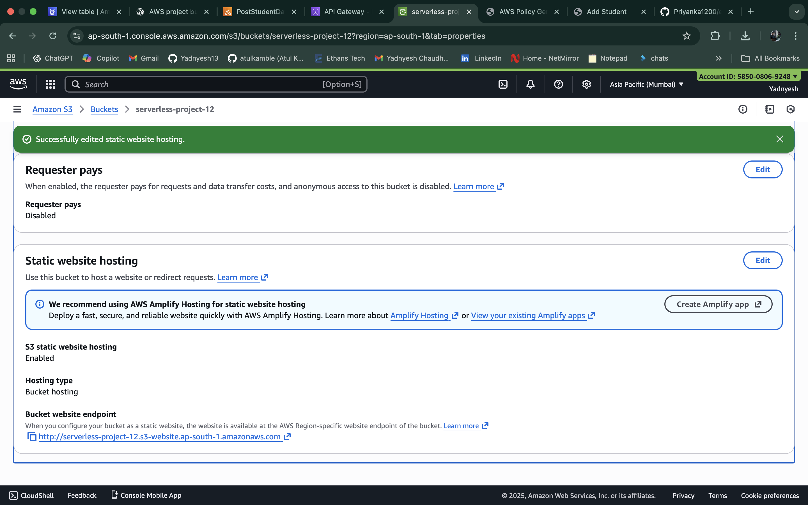

# AWS Serverless Student Management 

This repository contains a small example static front-end and companion Python scripts intended to demonstrate a simple serverless workflow (S3 static hosting + API Gateway + Lambda + DynamoDB). The content below is based on the `Notes` file included in this project and other files in the repo.

## Repository contents

- `index.html` — Landing / sample UI.
- `add_student.html` — Form page to add a student (uses `scripts.js`).
- `fetch_all_students.html` — Page to fetch and display all students.
- `scripts.js` — Client-side JavaScript (makes requests to API endpoints).
- `Python/` — Backend example scripts and policy/CORS snippets:
  - `getStudents.py` — sample GET handler (example Lambda script).
  - `insertStudentData.py` — sample POST/insert handler.
  - `BucketPolicy.txt`, `s3-CORS Policy.txt` — example policies for S3 hosting.
- `Screen_shots/` — Console screenshots (Lambda, DynamoDB, API Gateway, S3 hosting, etc.).

## Quick project summary

This project demonstrates a typical serverless setup to store and read student records:

- Data store: DynamoDB table named `studentData` with partition key `studentid`.
- Backend: AWS Lambda functions (Python 3.x), two sample functions:
  - `getStudentData` (GET)
  - `insertStudentData` (POST)
- API Gateway: a REST API named `student` exposing GET and POST methods which invoke the Lambda functions.
- Front-end: static site (HTML + JS) hosted on S3 static website hosting; `scripts.js` should call the API Gateway endpoint URL.

## Notes / Deployment checklist (from `Notes`)

1. IAM Role
	- Create an IAM role for Lambda with the needed permissions (e.g., DynamoDB Full Access if used for demo purposes).

2. DynamoDB
	- Create a table named `studentData`.
	- Partition key: `studentid`.

3. Lambda Functions
	- Create two Python 3 Lambda functions:
	  - `getStudentData` — returns student records (GET).
	  - `insertStudentData` — inserts a new student (POST).

4. API Gateway
	- Create an API (name it `student` or similar).
	- Add GET and POST methods that integrate with the two Lambda functions.
	- Enable CORS for GET and POST.
	- Deploy the API (e.g., stage `/` with stage name `prod`).
	- Copy the deployed REST endpoint URL and update `scripts.js` so the front-end uses that URL.

5. S3 static site hosting
	- Create an S3 bucket for hosting the static site.
	- Upload these files: `index.html`, `add_student.html`, `fetch_all_students.html`, and `scripts.js`.
	- Enable static website hosting for the bucket.
	- Configure the bucket policy to allow GetObject for public website access (or restrict to OAI if using CloudFront).
	- Add the S3 CORS configuration (see `Python/s3-CORS Policy.txt`).

## Screenshot(s)

Example screenshot included in this repo (used below):

There are additional screenshots in `Screen_shots/` such as `Lambda_Function1.png`, `DynamoDB_Table.png`, `API_Gateway.png`, etc. Use them for documentation or slide decks as needed.

---

